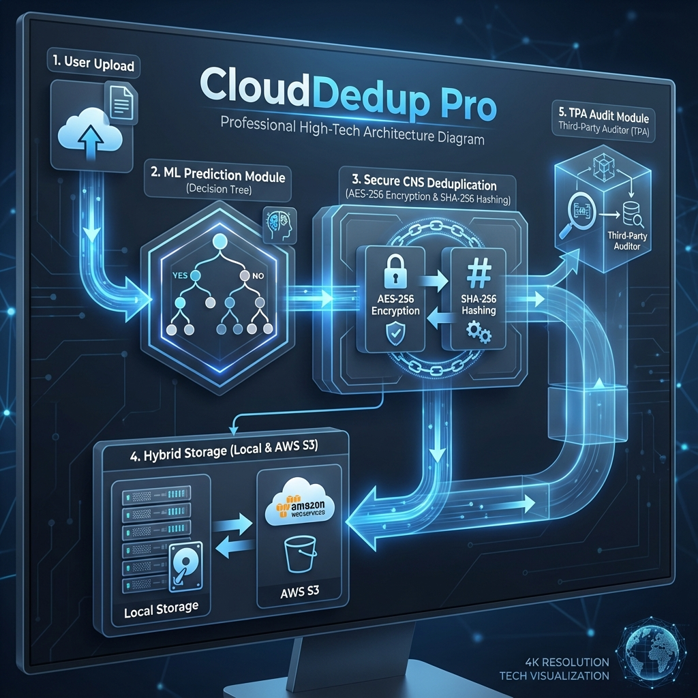

# Project Walkthrough: Secure Hybrid Cloud Deduplication

The complete system for ML-Assisted Lightweight Secure Data Deduplication is now functional.

## Key Modules Implemented

- **Backend (Python Flask)**: `app.py` serves as the core, integrating ML, Deduplication, and Auditing.
- **ML Module**: `ml_model.py` uses metadata to predict duplicates, optimizing storage workflows.
- **CNS Deduplication**: `dedup.py` handles AES encryption and SHA-256 hashing for secure, space-saving storage.
- **Integrity Auditing**: `auditing.py` simulates TPA-based block integrity verification.
- **Premium Frontend**: Responsive and modern UI built with Bootstrap 5 and Outfit typography.
- **Database**: SQLite-backed metadata storage with a clean schema.

## Features at a Glance

- **Cloud Analytics**: Real-time storage stats and deduplication rates on the dashboard.
- **Secure Uploads**: Automated encryption and deduplication during ingestion.
- **Audit Trails**: Detailed logs for all storage and integrity events.
- **Zero Branding**: All internal project code names ("Anti-Gravity") have been removed as requested.

## How to Verify

1.  **Start the Server**:
    ```bash
    python app.py
    ```
2.  **Access the App**: Open `http://127.0.0.1:5000` in your browser.
3.  **Upload a File**: Use the "Secure Upload" page to upload a file.
4.  **Repeat Upload**: Upload the *same* file again to verify the de-duplication logic and ML prediction.
5.  **Check Insights**: Visit the "Insights" (Dashboard) page to see the storage savings and audit your files.
6.  **Run Audit**: Click "Audit" on any file in the dashboard to trigger an integrity check.


